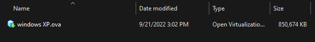
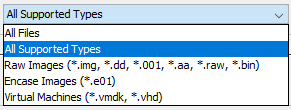
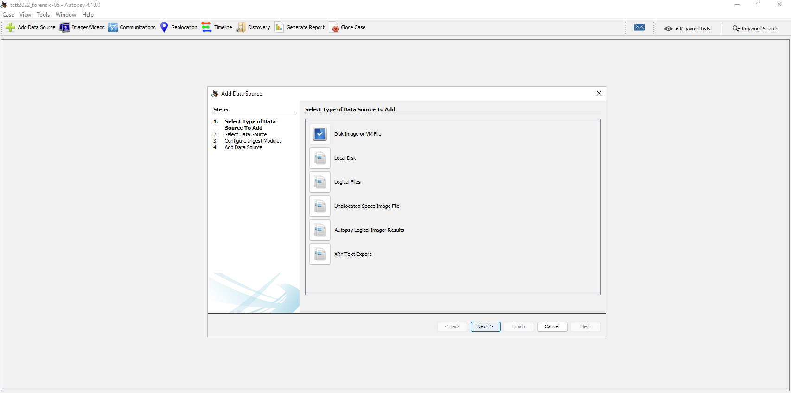
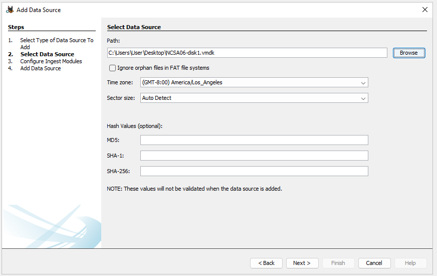
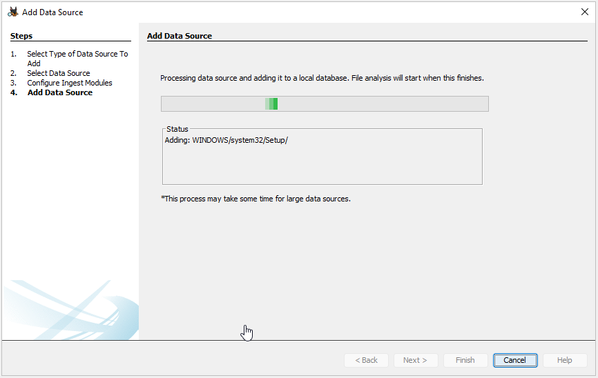
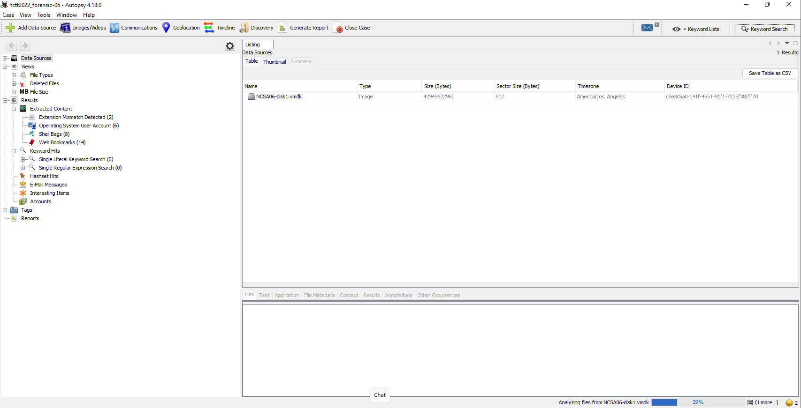
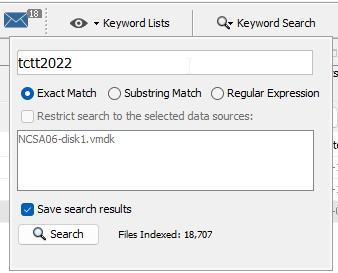
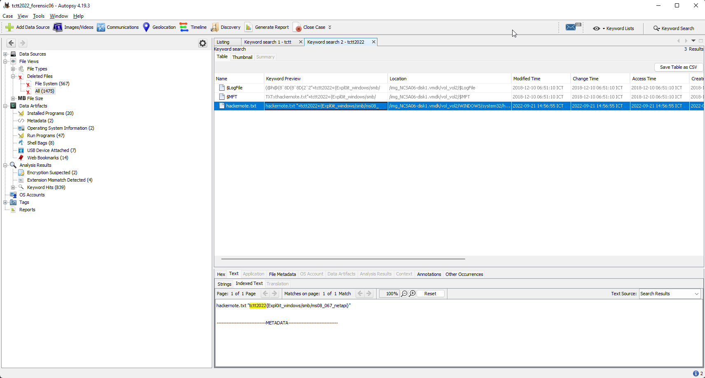
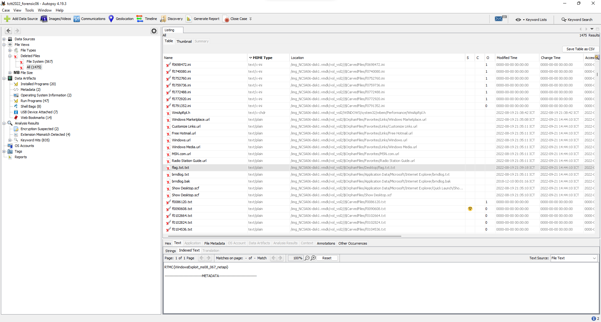

# Forensic - Challenge 06

This challenge was an windows xp ova file.

First you need to extract a disk image file for an disk forensic tools.

I used Autopsy to solve this challenge. Which support only vmdk format.

https://www.autopsy.com/download/

So i import ova into vmware workstation and copy a vmdk for next step.

Select Data Source as Disk Image or VM File

After imported data source. Wait for Autopsy to Analyzing file for a bit.

Search for a flag by click top right menu "Keyword Search".

Found flag in file "hackernote.txt".

---

## Extras

Found some interesting flag that not in this compitition too :)

