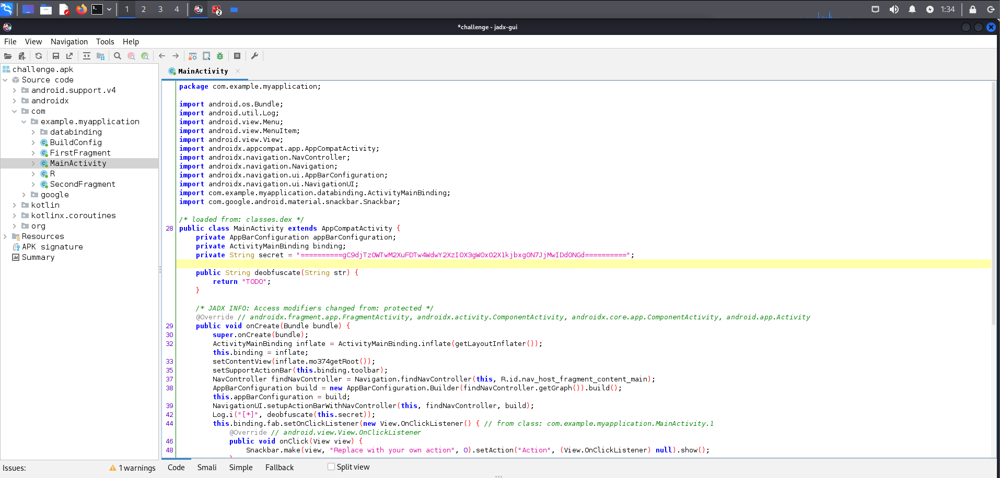
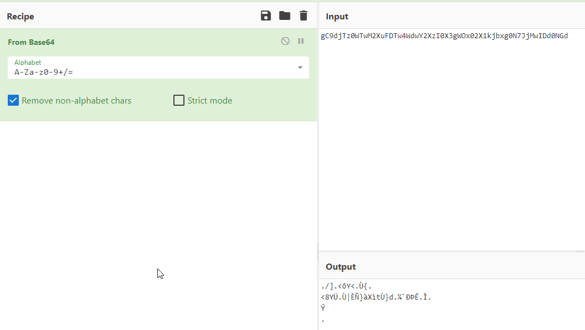
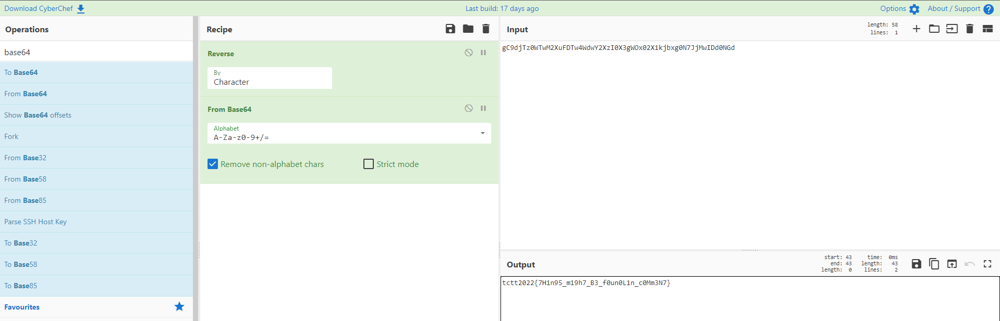

# Mobile - Challenge 06

This challenge was an apk file.

Decompile an apk file with jadx-gui.



Found secret in base64 format.

```
private String secret = "==========gC9djTz0WTwM2XuFDTw4WdwY2XzI0X3gWOx02X1kjbxg0N7JjMwIDd0NGd==========";
```

Try to decode with base64.



Try to reverse a strings and successfully decoded a flag.

