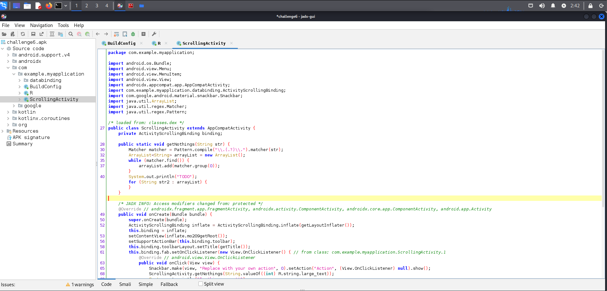
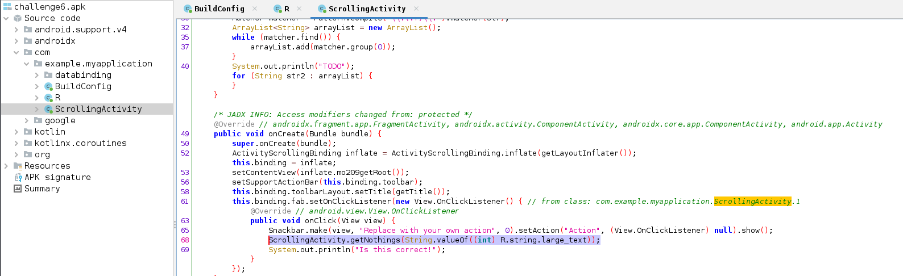
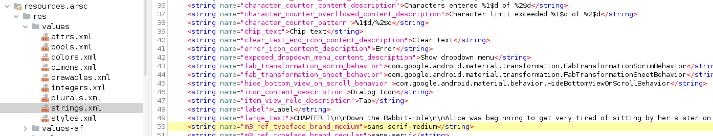
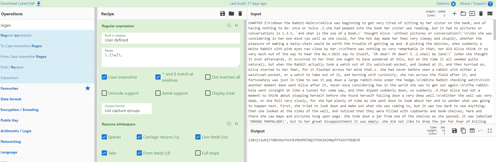
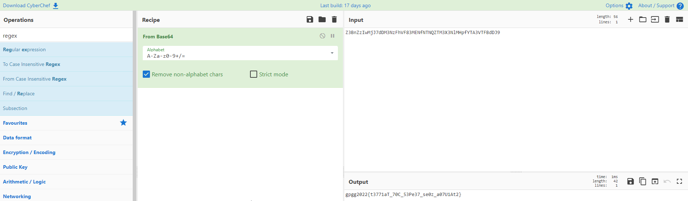
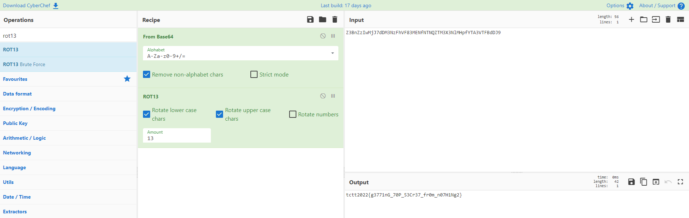

# Mobile - Challenge 06

This challenge was an apk file.

Decompile an apk file with jadx-gui.

Found some regex in source code.



Notice that line 68 was reference for a strings name large_text



Found a very large text.



Trying to mimic a code behavior, by use regex to extract a text.

REGEX

```
\.(\w)\.
```



```
Z3BnZzIwMjJ7dDM3NzFhVF83MENfNTNQZTM3X3NlMHpfYTA3VTFBdDJ9
```

Found a base64 format text.



Decoded

```
gpgg2022{t3771aT_70C_53Pe37_se0z_a07U1At2}
```

Notice that output has number and curly bracket. Try to shift a charactor by using ceasar chiper (ROT13)




