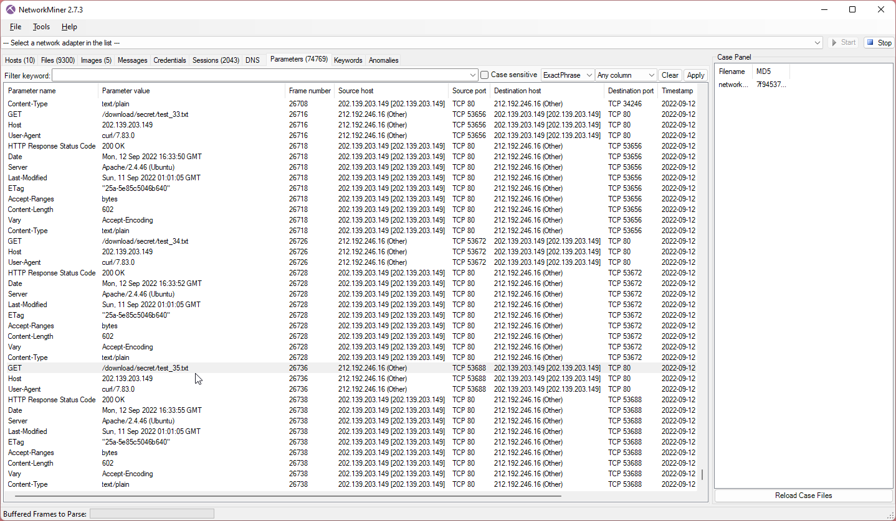

# Network - Challenge 02

This challenge was an pcap file.

Open pcap file with NetworkMiner.

Found that attacker was trying to bruteforce a directory.




If you use NetworkMiner like me. You can right click "open folder" to see all file from pcap dump.


Found secret.zip file


This time zip file contain a lot of text file.


To catch an SUS file, i trying to md5sum all file in directory.

```
md5sum *
```


Found an imposter. file test_69.txt

```
Vm0weGQxTXdNVWRYV0d4VFYwZG9WMVl3WkZOVU1WcHpXa2M1VjAxWGVGWlZiVEZIVmpGYWMySkVUbGhoTVhCUVZteFZlRmRIVmtkaVIwWlRWakpvYjFaclpIcGxSbGw1Vkd0YWFGSnRVbGhVVkVGM1pVWmtXR1JIZEZOaVZscDZWVzAxUzJGV1NuTmpTRUpYWVRGYVNGUnJXbHBsUm1SMFVteHdWMDFFVmxwV1ZFb3dZVEZaZVZOcmFHaFRSVXBYV1ZkMFlWUkdXbGRYYlhScVRWZFNlbFl5TVRCVWJVcEhZMFJhVjJKVVFYaFdWRVpyVTBaS2NWZHNaR2xTTW1odlZtMXdUMkl5UmtkalJWcFlZbFZhV0ZSWGRHRlRiR1J5VjJ0MFZXSlZjRWhaTUZwM1ZqSkZlVlJZYUZaaGExcG9WakJhVDJNeVNrZFRiV3hvVFRCS1dWWXhaRFJpTVVWNVZtNU9WMWRIVWxsWldIQnpWMFpTVjJGRlRsTmlSbkJKVkZaU1UyRkdXbk5qUkVaV1ZqTm9WRlpxUm1GV01rNUhWRzFHVTFKV2NFVldiR1EwVVRGYVZrMVZWazVTUkVFNQ==
```

Decode with base64 9 times

