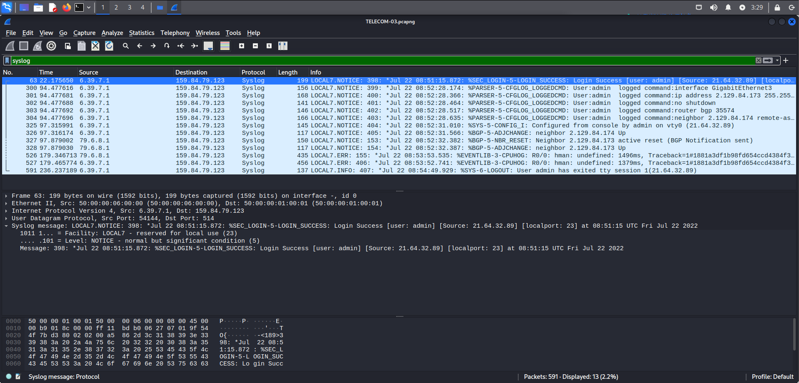
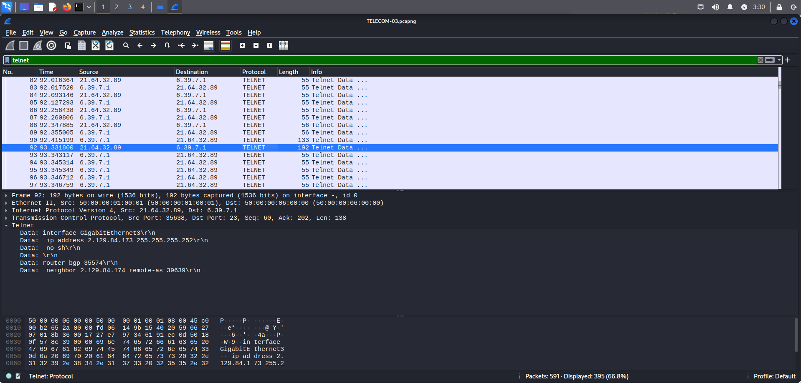
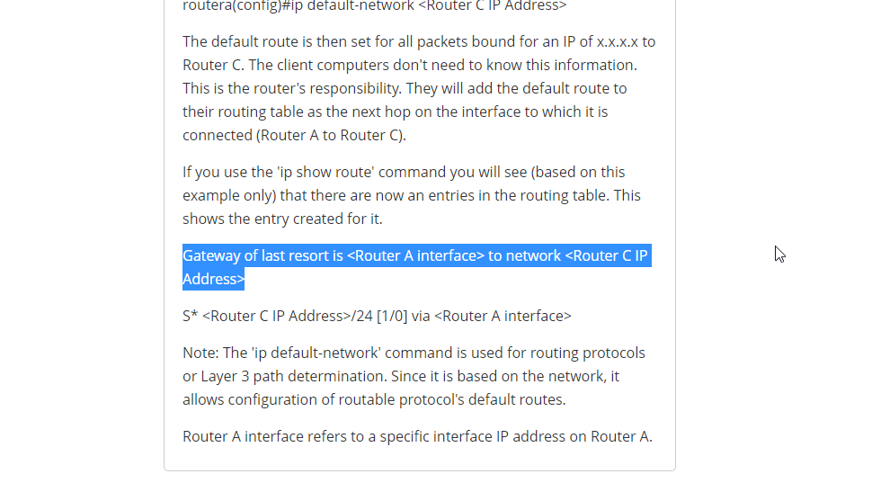
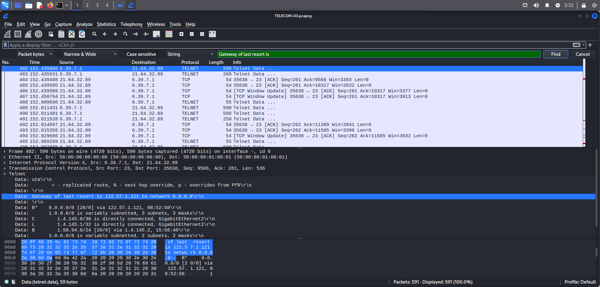
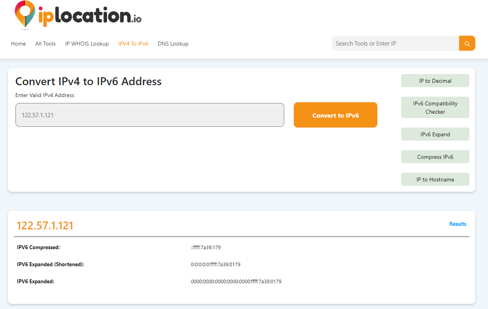
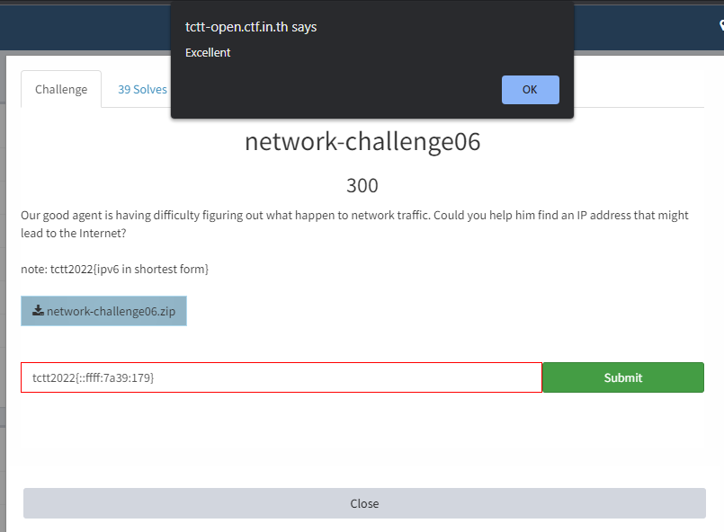

# Network - Challenge 06

This challenge was an pcapng file.

Challenge ask for an ipv6 address that might be able to connect to internet.

Open pcapng file with wireshark. (Or you can convert pcapng file to pcap file and used networkminer)

After view overall pcap file, I found out that this was a cisco bgp rounter config traffic.





I google about how to config gateway and found some interesting information.

```
https://community.spiceworks.com/how_to/164102-configure-a-gateway-of-last-resort-or-default-route-on-cisco-routers
```



Try search packet with keyword "Gateway of last resort"



Found ip 122[.].57.1.121

Convert to ipv6 and answer.

```
https://iplocation.io/ipv4-to-ipv6/122.57.1.121
```



```
::ffff:7a39:179
```

