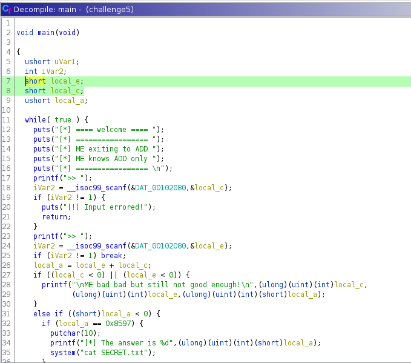
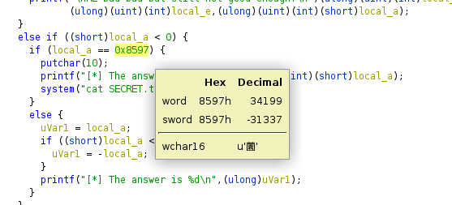
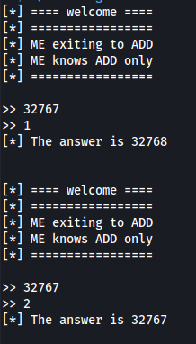
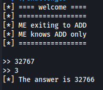

# Pwnable - Challenge 05

This challenge was an elf file.

Flag was stored on server.

Binary receive 2 user input as a short.



short datatype has a range of -32768 to +32767


Look at this part of code.

```c
    local_a = local_e + local_c;
    if ((local_c < 0) || (local_e < 0)) {
      printf("\nME bad bad but still not good enough!\n",(ulong)(uint)(int)local_c,
             (ulong)(uint)(int)local_e,(ulong)(uint)(int)(short)local_a);
    }
    else if ((short)local_a < 0) {
      if (local_a == 0x8597) {
        putchar(10);
        printf("[*] The answer is %d",(ulong)(uint)(int)(short)local_a);
        system("cat SECRET.txt");
      }
      else {
        uVar1 = local_a;
        if ((short)local_a < 1) {
          uVar1 = -local_a;
        }
        printf("[*] The answer is %d\n",(ulong)uVar1);
      }
    }
```


First, it receive user input as local_e and local_c.

Then it store value of local_e add local_c in local_a.

```c
    local_a = local_e + local_c;
```

If user input 1 and 2 was lower then 0 it's will print error message

```c
    if ((local_c < 0) || (local_e < 0)) {
      printf("\nME bad bad but still not good enough!\n",(ulong)(uint)(int)local_c,
             (ulong)(uint)(int)local_e,(ulong)(uint)(int)(short)local_a);
    }
```

To get a flag, I must somehow send input 1 and input 2 that **Not lower then 0** and total **must be lower then zero** and value = -31337



What happened when total was more then 32767 is it's become **minus**.





So i send first number as 32767 and second number as 1432 and got a flag


