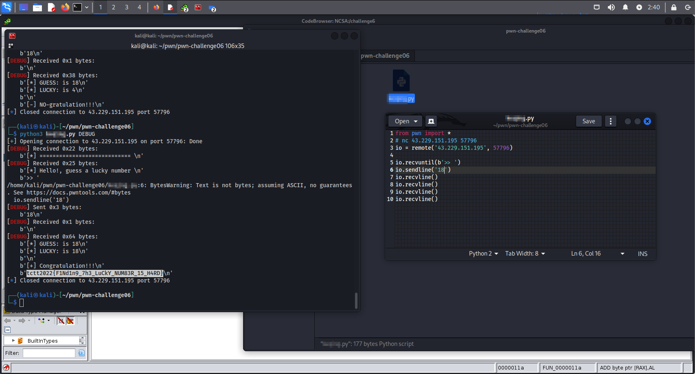

# Pwnable - Challenge 06

This challenge was an elf file.

Flag was stored on server.

Binary was receive 1 user input as a number.

I try wrote a script to send a same number in short amout of time.

Too lazy to write a loop, but i got lucky in 3 times :D

[Fnnnr](https://medium.com/@fnnnr) has writen a very detailed write-ups [here](https://medium.com/@fnnnr/tctt2022-pwnable-06-a0e8b83ab447)